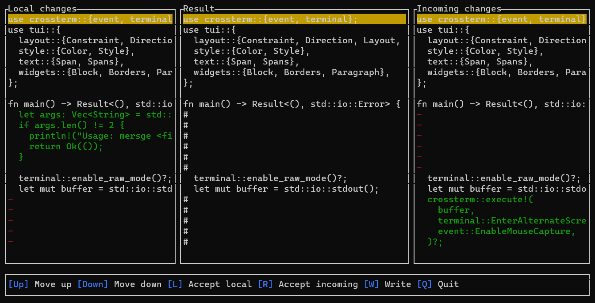

# Mersge
Simple 3-way merge editor for the terminal



## Run
```mersge <file>```

## Usage
- ```Arrow Up``` - move up
- ```Arrow Down``` - move down
- ```L``` - accept local
- ```R``` - accept incoming
- ```W``` - write file
- ```Q``` - quit
 
## Build
```cargo build```

## Test
```cargo test```

## Todo
- scrolling columns
- manual edit
